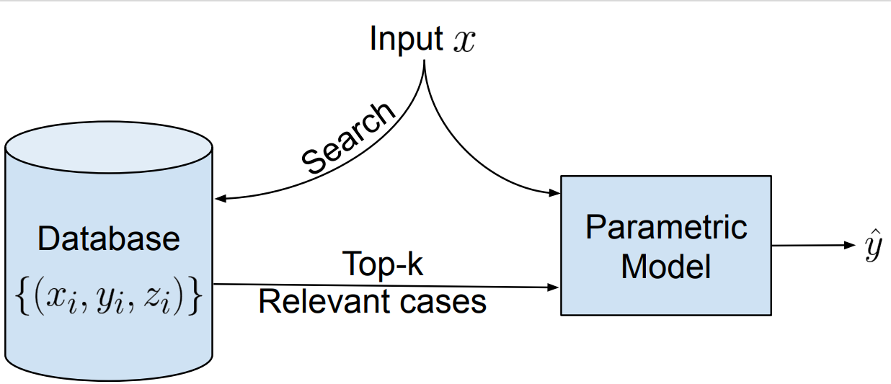

**Update 03/03/2022: Due to a technical issue on the submission site, we've extended the submission deadline to 03/08. Please check the new [dates](#important-dates) below!**

**Update 02/04/2022: Deadlines extended! In order to accomodate more submissions, we've extended the submission deadlines by a few days! Please check the new [dates](#important-dates) below!**

**Update 02/04/2022: Date confirmed! Spa-NLP @ ACL2022 will be held on the 27th May** 

## Overview

Large parametric language models have achieved dramatic empirical success across many applications. However, these models lack several desirable properties such as explainability (providing provenance), privacy (ability to remove knowledge from the model), robust controllability, and debuggability. On the other hand, nonparametric models provide many of these features by design such as provenance, ability to incorporate/remove information. However, these models often suffer from weaker empirical performance as compared to deep parametric models.

Recently, many works have independently proposed a middle ground that combines a parametric model (that encodes logic) with a nonparametric model (that retrieves knowledge) in various areas from question answering over natural languages to complex reasoning over knowledge bases to even protein structure predictions. Given the increasingly promising results on various tasks of such [semiparametric model](https://en.wikipedia.org/wiki/Semiparametric_model), we believe this area is ripe for targeted investigation on understanding efficiency, generalization, limitations, widening its applicability, etc. As a result, we want to host a workshop on this topic.

  

## Submissions

Our workshop seeks paper submissions which address this topic. 
Submissions can be long (up to 8 pages) or short (up to 4 pages) and should follow the ACL paper tempate. 
Authors will submit papers for peer review from our program commitee.
Alternatively, we will also be accepting ARR submissions (with reviews).
Since submissions from ARR will come with reviews, the submission deadline for these papers will be later.

Authors of relevant, already-published work can also choose to submit their work to a non-archival track. 

Please check out our [Call for Papers](cfp) for more details!

## Invited Speakers

- [Danqi Chen](https://www.cs.princeton.edu/~danqic/), Princeton University
- [Hannaneh Hajishirzi](https://homes.cs.washington.edu/~hannaneh/), University of Washington & Allen Institute for AI
- [Andrew McCallum](https://people.cs.umass.edu/~mccallum/), University of Massachusetts, Amherst
- [Anna Potapenko](http://apotapenko.com/), Google Deepmind
- [Jason Weston](https://ai.facebook.com/people/jason-weston/), Facebook AI Research

We will also have a panel discussion with speakers and other inivted panelists

## Important Dates

(All AoE)
- Submission deadline (for papers requiring peer review): ~~February 28th~~ ~~March 3rd, 2022~~ March 8th, 2022
- Submission deadline (with ARR reviews): March 24th, 2022
- Submission deadline (Non-archival): March 24th, 2022
- Notification of acceptance: March 26th, 2022
- Camera-ready paper deadline: April 10th, 2022
- Workshop date: May 27th, 2022

## Submission guidelines
We seek submissions of original work or work-in-progress. Submissions can be in the form of long/short papers and should follow the ACL main conference template. We will follow double-blind review process. Authors can choose to make their paper achival/non-archival. All accepted papers will be presented at the workshop.
We also will accept ACL rolling review (ARR) submissions with reviews. Since these submissions already come with reviews, the submission deadline is much later than the initial deadline. 

<!-- Non-archival track also seeks recently accepted / published work---it does not need to be anonymized and will not go through the review process. The submission should clearly indicate the original venue and will be accepted if the organizers think the work will benefit from exposure to the audience of this workshop. -->

We will use Open Review for the submissions.

For papers needing review: click "ACL 2022 Workshop Spa-NLP submission"
For papers from ARR: click "ACL 2022 Workshop Spa-NLP commitment Submission"

Submission Link: <https://openreview.net/group?id=aclweb.org/ACL/2022/Workshop/Spa-NLP>

## Best paper award
Thanks to generous support from our sponsors, we will award the best paper award (with cash prize) to one of the submissions selected by our program committee and organizing committee. The best paper will be given the opportunity for a lightning talk to introduce their work.

## Organizing Committee
- [Rajarshi Das](http://rajarshd.github.io/), University of Massachusetts Amherst
- [Patrick Lewis](https://www.patricklewis.io/), University College London
- [Sewon Min](https://shmsw25.github.io/), University of Washington
- [June Thai](https://dungtn.github.io/), University of Massachusetts Amherst
- [Manzil Zaheer](http://www.manzil.ml/), Google DeepMind

## Sponsors (Confirmed)

